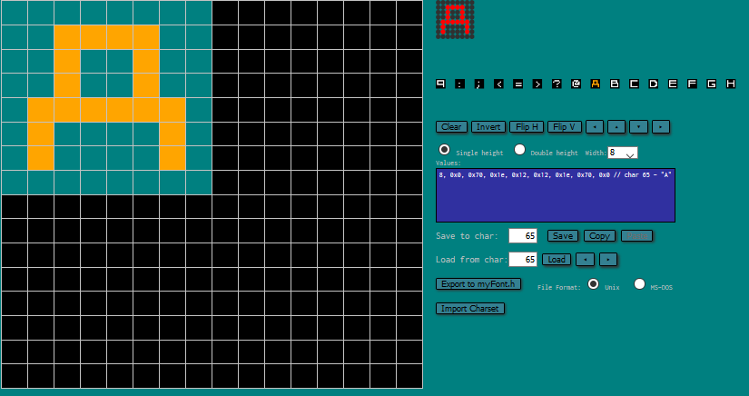

# md_max72xx-font-designer

_version 1.0.4 - 2018-05-03_

Simple font designer for md_max72xx / md_parola libs
It supports single (8) and double (16) height chars. Maximum width is 16. Each character can have it's own width.

The font designer that comes with md_max72xx and md_parola libs works only on Microsoft Office.
I needed to draw a font for a project I'm working on using this libs and I don't own Microsoft Office, so this is what I came up with.

It is implemented as a standalone html page with javascript inside, it have zero dependencies, it doesn't need a server, nor a framework, nor any javascript lib.

It's not beautiful, it just do the job. It doesn't use any 'advanced' HTML/CSS/Javascript technics, so, I hope that its compatibility is close to Universal with any modern Browser. I've been developing it with Firefox 52.7.2, I did some basic testing with Chrome and Microsoft Edge and it works, some messages are not correctly formated but there is no major problem.
I don't have access to a Mac so, I have no idea if it works with Safari.

**Installation**
---------------
Put the file "fd1.html" in some place handy, maybe in your Desktop. That is all. To use it, just double click on the file, it should open in your browser.

**Saving a font**
-----------------
The full font can be saved as a .h file, ready to be #include'ed in your .ino
Press the button "Export to myFont.h" and save the file somewhere on your disk, then move it to the same directory where your .ino is and, at the start of your sketch, put an #include "myFont.h" (or whatever name you used for the file).

**Loading a font**
------------------
Loading a font is not as easy. As far as I know, a standalone html page can't process a file upload, and I want this page to be standalone, so, you have to:

  * Open the .h file with your font on a text editor (or in the Arduino IDE), select the full array and copy it to the clipboard.

  * Back to the page, press the button "Import Charset", this opens a white text area. Paste the text inside it and click on the "IMPORT" button down below. 

**WARNING**: *Don't mess too much with the array definition, the parser is quite basic, if you paste back more or less what was saved you'll be ok, but it will not work if you copy just a few lines, at least, make sure that you copy everthing that's inside the { ... } (including the brackets). Comments marked with // at the end of each line are ok, but don't try to use comments with the /\* and \*/ C syntax, that will not work (the parser is really basic, you know).*

Good luck.
